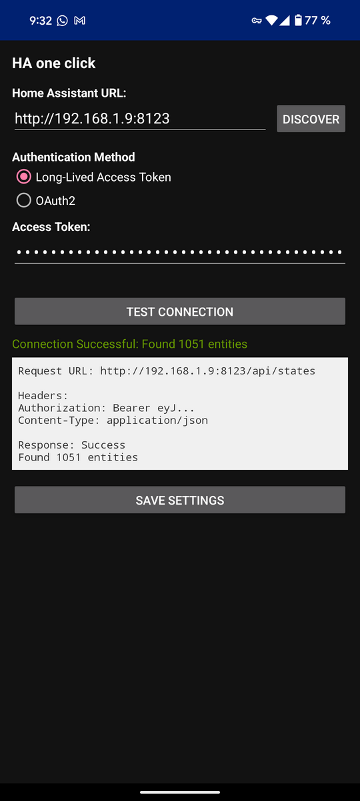
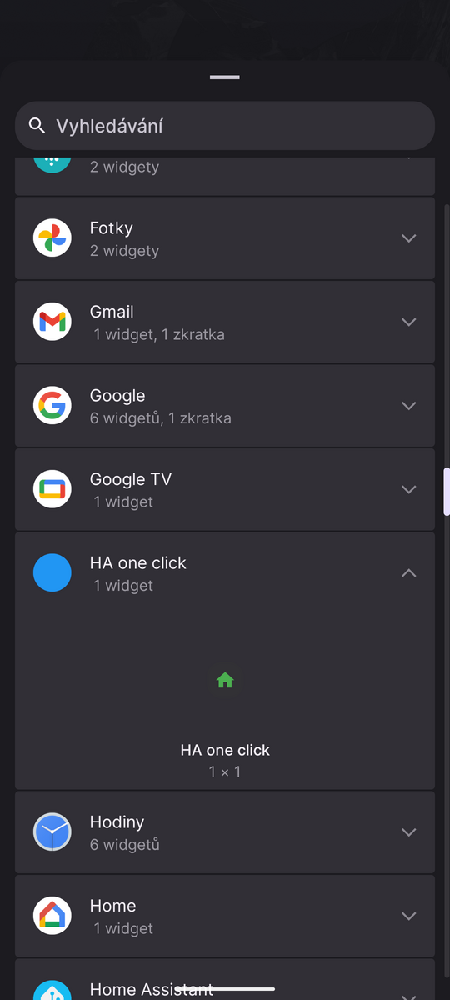
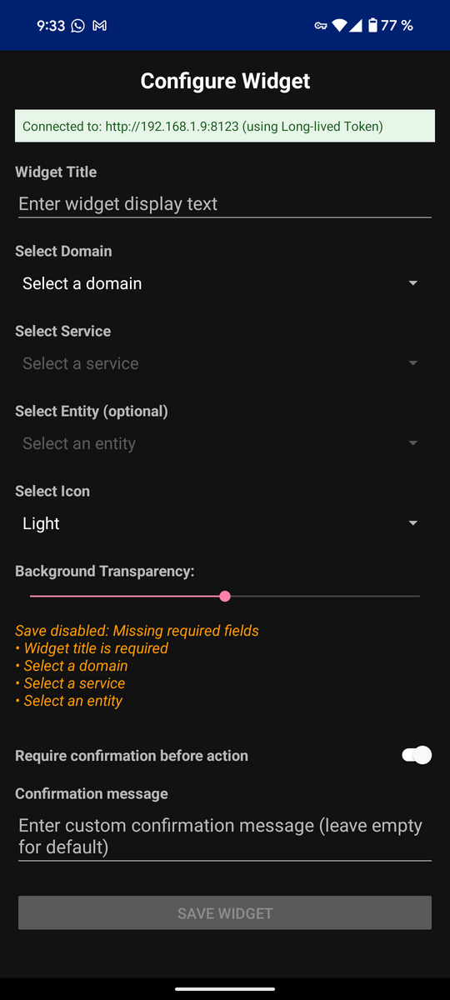
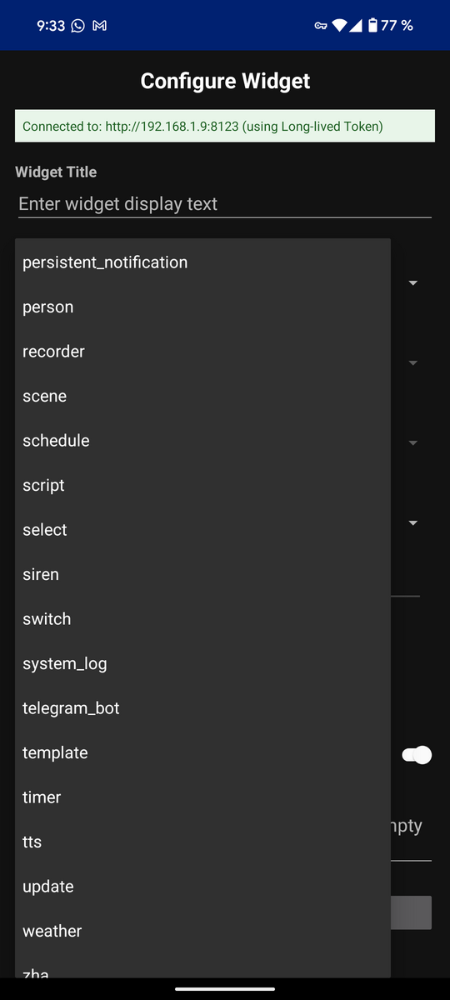
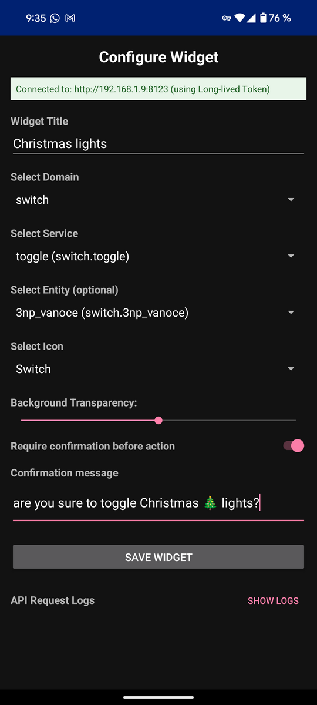
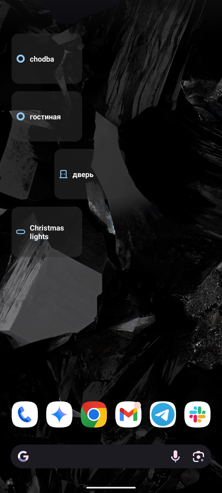
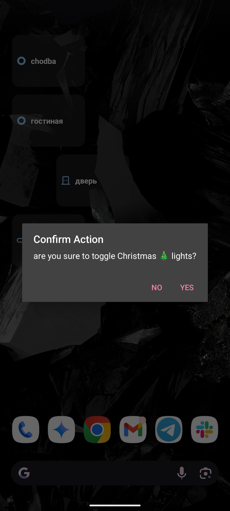

# HA-one-click
Android desktop widget to make fast requests to Home Assistant on click

## Description
HA-one-click is a lightweight Android widget application that allows you to create quick-access controls for your Home Assistant entities directly on your Android home screen. The widget provides a simple way to toggle switches, control lights, and trigger Home Assistant services with just one tap.

## Features
- Create custom widgets for any Home Assistant entity
- Connect to your Home Assistant instance via Long-lived Access Token
- Toggle actions with or without confirmation dialogs
- Customize widget appearance with different icons and transparency levels
- Support for various entity domains including switches, lights, and scenes
- No need to install the full Home Assistant Android application

## Setup
1. Install the app
2. Add the widget to your home screen
3. Configure your Home Assistant URL (e.g., http://192.168.1.9:8123)
4. Enter your Long-lived Access Token
5. Select domain, service, and entity
6. Customize the widget appearance and confirmation settings
7. Save the widget

## Screenshots

| Widget Configuration | Entity Selection | Domain Selection |
|:-------------------:|:----------------:|:----------------:|
|  |  |  |

| Service Selection | Confirmation Dialog | Connection Settings |
|:----------------:|:------------------:|:------------------:|
|  |  |  |

| Appearance Settings |
|:------------------:|
|  |

P.S.: it's just small widget for Android which I needed for my children to make some actions with and without confirmation.
Doesn't require installation of Home Assitant android application and so on. Use on your own risk.
